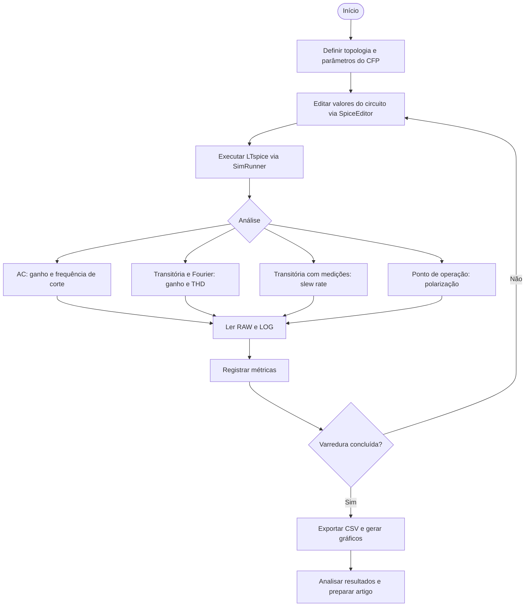

# Fluxograma do processo de simulação

```mermaid
flowchart TD
 A([Início]) --> B[Definir topologia e parâmetros do CFP]
 B --> C[Editar valores do circuito via SpiceEditor]
 C --> D[Executar LTspice via SimRunner]
 D --> E{Análise}
 E --> F[AC: ganho e frequência de corte]
 E --> G[Transitória e Fourier: ganho e THD]
 E --> H[Transitória com medições: slew rate]
 E --> I[Ponto de operação: polarização]
 F --> J[Ler RAW e LOG]
 G --> J
 H --> J
 I --> J
 J --> K[Registrar métricas]
 K --> L{Varredura concluída?}
 L -- Não --> C
 L -- Sim --> M[Exportar CSV e gerar gráficos]
 M --> N[Analisar resultados e preparar artigo]
```

**Observação:** este é o fluxo lógico agregado dos scripts, não uma função única já implementada.
